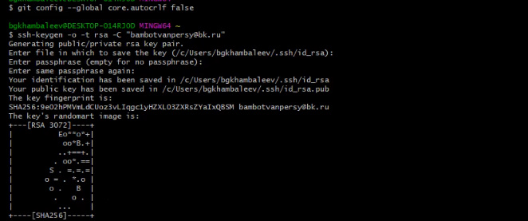

---
## Front matter
lang: ru-RU
title: Отчёт по лабораторной работе 1
author: 'Хамбалеев Булат Галимович'
date: 17 сентября, 2022

## Formatting
toc: false
slide_level: 2
theme: metropolis
mainfont: Ubuntu
romanfont: Ubuntu
sansfont: Ubuntu
monofont: Ubuntu
header-includes: 
 - \metroset{progressbar=frametitle,sectionpage=progressbar,numbering=fraction}
 - '\makeatletter'
 - '\beamer@ignorenonframefalse'
 - '\makeatother'
aspectratio: 43
section-titles: true
---

## Цель работы

Изучить идеологию и применение средств контроля версий. Освоить умения по работе с git.

## Задание

Лабораторная работа подразумевает использование git для создания репозитория для лабораторных работ.

# Выполнение лабораторной работы

1. Создадим аккаунт на GitHub.

{ #fig:001 width=70% }

---

2. Зададим SSH ключ.

{ #fig:002 width=70% }

---

3. Добавим в аккаунт SSH ключ.

{ #fig:003 width=70% }

---

4. Создание репозитория.

{ #fig:004 width=70% }

---

5. Сделаем первый commit.

{ #fig:005 width=70% }

---

## {.standout}

Спасибо за внимание
