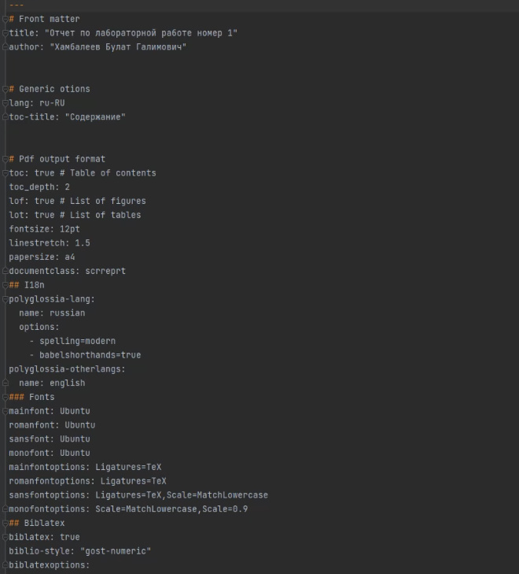
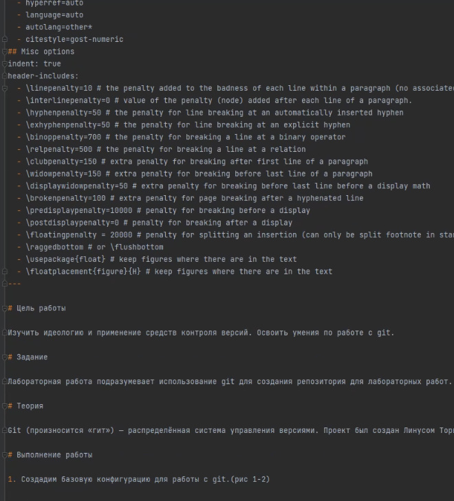
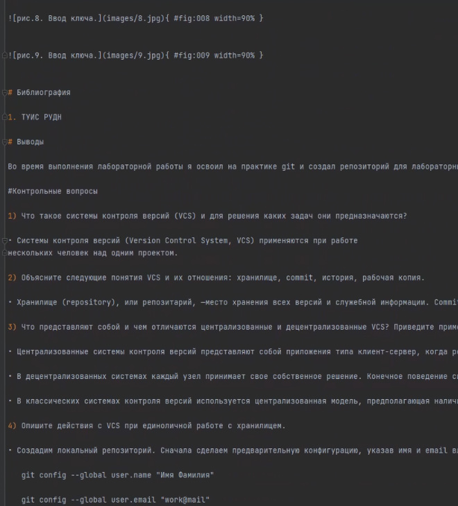
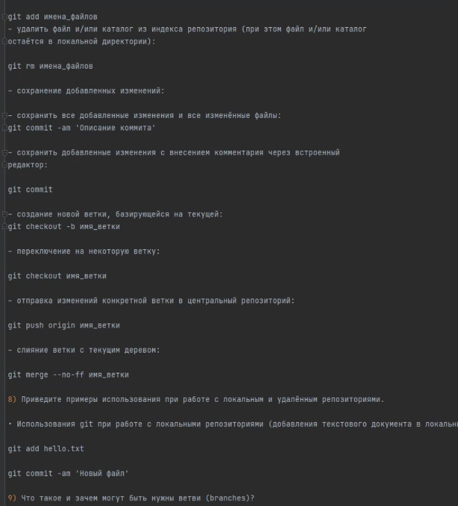

---
## Front matter
lang: ru-RU
title: Отчёт по лабораторной работе 2
author: 'Хамбалеев Булат Галимович'
date: 1 октября, 2022

## Formatting
toc: false
slide_level: 2
theme: metropolis
mainfont: Ubuntu
romanfont: Ubuntu
sansfont: Ubuntu
monofont: Ubuntu
header-includes: 
 - \metroset{progressbar=frametitle,sectionpage=progressbar,numbering=fraction}
 - '\makeatletter'
 - '\beamer@ignorenonframefalse'
 - '\makeatother'
aspectratio: 43
section-titles: true
---

## Цель работы

Научиться оформлять отчёты с помощью легковесного языка разметки Markdown.

## Задание

Лабораторная работа подразумевает использование Markdown для оформления отчёта.

# Выполнение лабораторной работы

1. Установим настройки шаблона.(рис. 1)

{ #fig:001 width=70% }

---

2. Запишем цели, задание и теорию.(рис.2)

{ #fig:002 width=70% }

---

3. Запишем ход работы.(рис 3)

{ #fig:003 width=70% }

---

4. Запишем ответы на контрольные вопросы. (рис. 4)

{ #fig:004 width=70% }

---

## {.standout}

Спасибо за внимание
