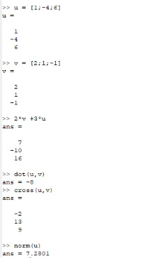
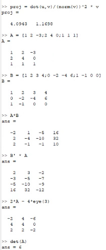
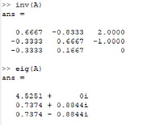
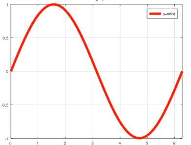
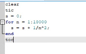

---
## Front matter
lang: ru-RU
title: Отчёт по лабораторной работе 3
author: 'Хамбалеев Булат Галимович'
date: 15 октября, 2022

## Formatting
toc: false
slide_level: 2
theme: metropolis
mainfont: Ubuntu
romanfont: Ubuntu
sansfont: Ubuntu
monofont: Ubuntu
header-includes: 
 - \metroset{progressbar=frametitle,sectionpage=progressbar,numbering=fraction}
 - '\makeatletter'
 - '\beamer@ignorenonframefalse'
 - '\makeatother'
aspectratio: 43
section-titles: true
---

## Цель работы

Получить базовые представления о работе с Octave.

## Задание

Лабораторная работа подразумевает использование Octave и использование его стандартных команд.

# Выполнение лабораторной работы

1.  Выполним операции с векторами.(рис.1)

{ #fig:001 width=70% }

---

2. Вычислим проектор и сделаем некоторые матричные операции. (рис 2)

{ #fig:002 width=70% }

---

3. Закончим с матричными операциями. (рис. 3)

{ #fig:003 width=70% }

---

4. Построим график синуса. (рис. 4)

{ #fig:004 width=70% }

---

5. Построим график x^2*sin(x). (рис. 6)

{ #fig:005 width=70% }

---

## {.standout}

Спасибо за внимание
