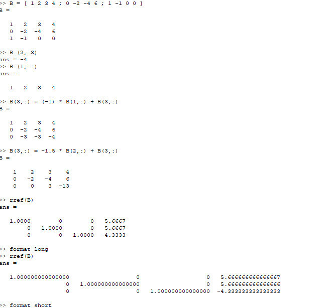
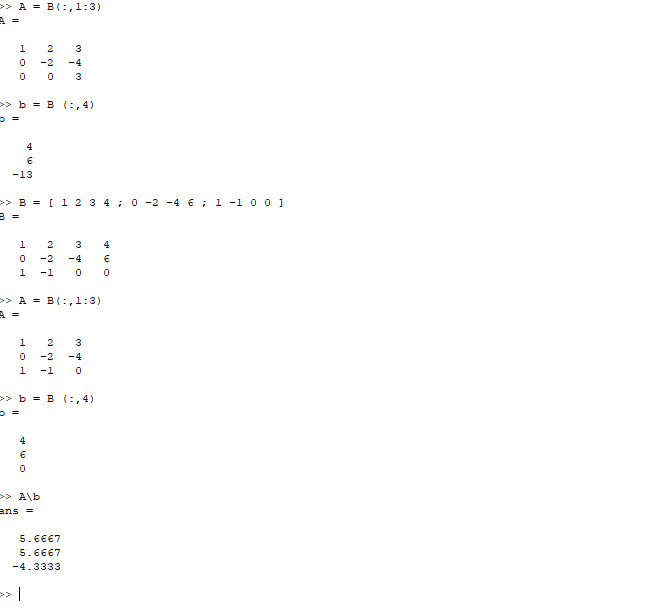

---
## Front matter
lang: ru-RU
title: Отчёт по лабораторной работе 4
author: 'Хамбалеев Булат Галимович'
date: 29 октября, 2022

## Formatting
toc: false
slide_level: 2
theme: metropolis
mainfont: Ubuntu
romanfont: Ubuntu
sansfont: Ubuntu
monofont: Ubuntu
header-includes: 
 - \metroset{progressbar=frametitle,sectionpage=progressbar,numbering=fraction}
 - '\makeatletter'
 - '\beamer@ignorenonframefalse'
 - '\makeatother'
aspectratio: 43
section-titles: true
---

## Цель работы

Получить базовые представления о работе с системами линейных уравнений в Octave.

## Задание

Лабораторная работа подразумевает использование Octave и использование его стандартных команд.

# Выполнение лабораторной работы

1.  Выполним простейшие операции связанные с методом Гаусса.

{ #fig:001 width=70% }

---

2. Выполним операции с левым делением.

{ #fig:002 width=70% }

---

## {.standout}

Спасибо за внимание
