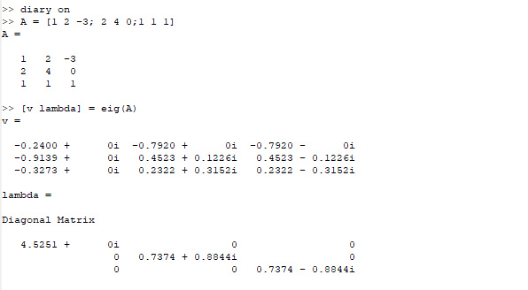
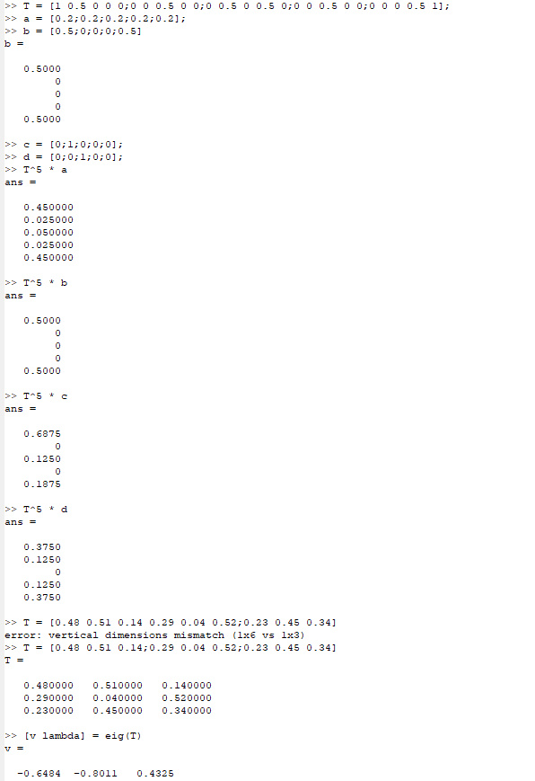
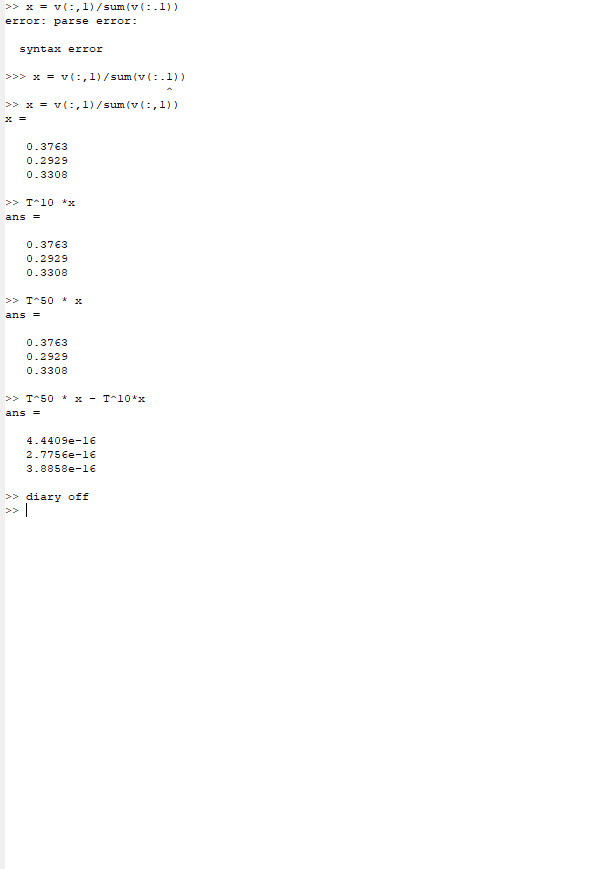

---
## Front matter
lang: ru-RU
title: Отчёт по лабораторной работе 8
author: 'Хамбалеев Булат Галимович'
date: 17 декабря, 2022

## Formatting
toc: false
slide_level: 2
theme: metropolis
mainfont: Ubuntu
romanfont: Ubuntu
sansfont: Ubuntu
monofont: Ubuntu
header-includes: 
 - \metroset{progressbar=frametitle,sectionpage=progressbar,numbering=fraction}
 - '\makeatletter'
 - '\beamer@ignorenonframefalse'
 - '\makeatother'
aspectratio: 43
section-titles: true
---

## Цель работы

Получить базовые представления о работе с собственными значениями и марковскими цепями в Octave.

## Задание

Лабораторная работа подразумевает использование Octave и использование его стандартных команд.

# Выполнение лабораторной работы

1.   Выполним простейшие операции связанные с собственными значениями и собственными векторами.(рис. 1)

{ #fig:001 width=70% }

---

2.  Выполним операции с марковскими цепями.(рис.2)

{ #fig:002 width=70% }

---

3. Выполним операции с марковскими цепями. (рис.3)

{ #fig:003 width=70% }

---

## {.standout}

Спасибо за внимание
